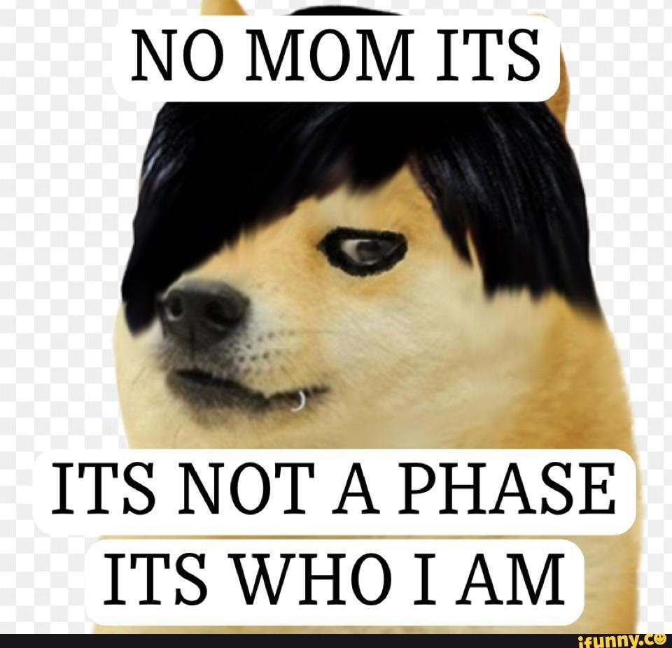

# Quantum Phase Estimation

<p align="center">
  
</p>

This library is a framework for quantum phase estimation, a fundamental building block to many quantum algorithms.

## Authors
- [@hjaleta](https://www.github.com/hjaleta)
- [@riccardo205](https://www.github.com/riccardo205)
- [@cbelo](https://www.github.com/cbelo)
## Installation
Install with pip
```bash
  pip install QPE
```
## Requirements

* qiskit
* numpy
* quantuminspire
